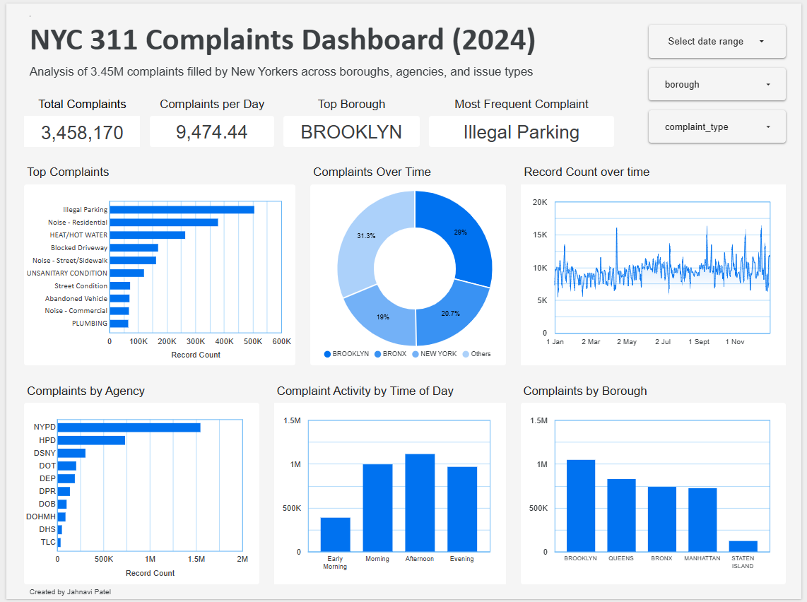

# NYC 311 Service Request Monitoring – 2024

This project delivers an end-to-end solution to collect, process, and analyze over 3.45 million 311 service requests submitted by New York City residents in 2024. The final output is an interactive dashboard designed to support data-informed decision-making for operational leaders, public service managers, and urban planners.

---

## Project Summary

New York City’s 311 system captures millions of public complaints annually, ranging from noise disturbances to sanitation issues. This project operationalizes that raw data into a structured, filterable system that enables stakeholders to:

- Monitor complaint trends over time
- Understand patterns by geography, time of day, and issue type
- Evaluate resolution efficiency and departmental response volume
- Pinpoint high-demand areas for more efficient resource allocation

---

## Features & Capabilities

- **Dynamic dashboard** built in Looker Studio, powered by a structured dataset hosted in BigQuery
- Time-based filtering by **hour**, **weekday**, and **month**
- Aggregation by **complaint type**, **borough**, and **responsible agency**
- **Resolution time** calculated and visualized at multiple levels
- **Geospatial mapping** of service requests across NYC neighborhoods

---

## Technology Stack

| Layer              | Tools Used                                           |
|-------------------|------------------------------------------------------|
| Data Source        | NYC Open Data – 311 Service Requests (2024)         |
| Data Processing    | Python (Pandas, datetime parsing, transformation)   |
| Storage            | Google Cloud Storage (GCS)                          |
| Query Engine       | Google BigQuery                                     |
| Visualization      | Looker Studio (Google Data Studio)                 |

---

## Key Outcomes

- Enabled exploration of complaint volume across **24-hour cycles**, **weekly rhythms**, and **monthly trends**
- Identified top complaint categories citywide and within each borough
- Revealed departments handling the highest public service load
- Quantified average resolution times to assess service efficiency
- Mapped complaint hotspots for geo-targeted interventions

---

## Deliverables

- Cleaned and structured dataset with enriched features (e.g., resolution time, time-of-day grouping)
- BigQuery-hosted table optimized for large-scale aggregation and filtering
- Interactive dashboard link with full filter capability (by date, borough, complaint type, etc.)
- Supporting documentation and transformation logic

---

## Access the Dashboard

[View the Interactive NYC 311 Complaints Dashboard – 2024](#) *https://lookerstudio.google.com/s/pXw4xt_BvLQ*
